# FDTD PIC Simulations

Modular **Tidy3D** electromagnetic simulations for silicon photonics (Project 2). Companion to the layout-only [PIC-component-Library](https://github.com/Shahbaz-z/PIC-component-Library) — same SOI stack defaults, but here Maxwell’s equations validate the physics that Project 1 models at the layout and coupled-mode level.

| Module | Notebook | Solver | Physics |
|--------|----------|--------|---------|
| Setup smoke test | [`notebooks/00_setup_smoke_test.ipynb`](notebooks/00_setup_smoke_test.ipynb) | Cloud FDTD | Pipeline verification |
| Mode width sweep | [`notebooks/01_mode_width_sweep.ipynb`](notebooks/01_mode_width_sweep.ipynb) | ModeSolver (local) | \(n_\mathrm{eff}\) vs strip width |
| Coupler gap sweep | [`notebooks/02_coupler_gap_sweep.ipynb`](notebooks/02_coupler_gap_sweep.ipynb) | 3D FDTD (cloud) | Power splitting vs gap |
| Ring Q-factor | [`notebooks/03_ring_q_factor.ipynb`](notebooks/03_ring_q_factor.ipynb) | Broadband FDTD (cloud) | Lorentzian Q, FSR |

## Executive summary

| Module | Solver | Key result |
|--------|--------|------------|
| 0 — Setup | Cloud FDTD | Pipeline verified; straight waveguide field looks correct |
| 1 — Modes | ModeSolver (local) | \(n_\mathrm{eff}\): ~1.8 @ 300 nm → ~2.7 @ 800 nm; single-mode window **400–500 nm** |
| 2 — Coupler | 3D FDTD | Fitted κ₀ = **0.195**, decay = **0.124 µm**; Project 1 toy κ₀ = 3 does not match this cell |
| 3 — Ring | Broadband + fine FDTD | **Q ≈ 25,600** (multi-Lorentzian fit); FSR ~**1.14–1.16 THz** (analytical vs simulation) |

---

## Findings

### Module 0 — Setup smoke test

A minimal straight waveguide cloud run confirms Tidy3D auth, geometry assembly, and field monitors before the heavier sweeps.

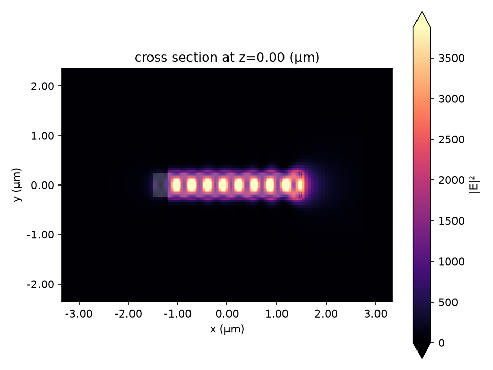

### Module 1 — Mode width sweep

Tidy3D’s local ModeSolver on a 220 nm SOI strip at 1550 nm shows the fundamental TE mode effective index rising with strip width as lateral confinement improves. A second mode becomes relevant near **700 nm**; for single-mode operation at 1550 nm, stay near **400–500 nm**.

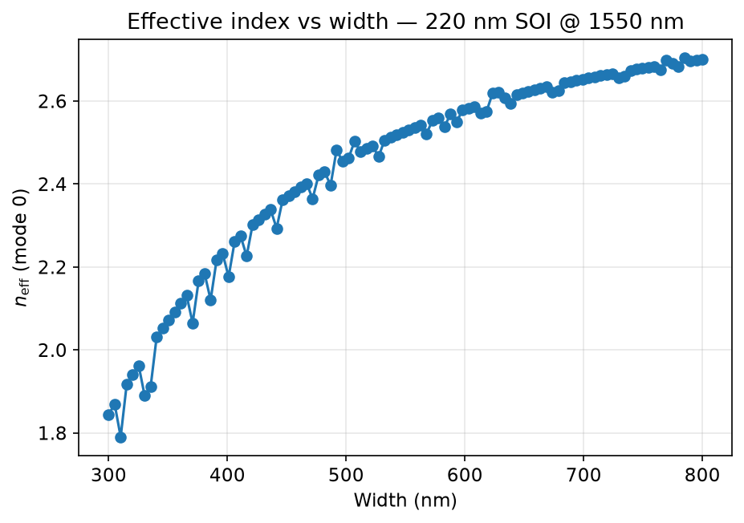

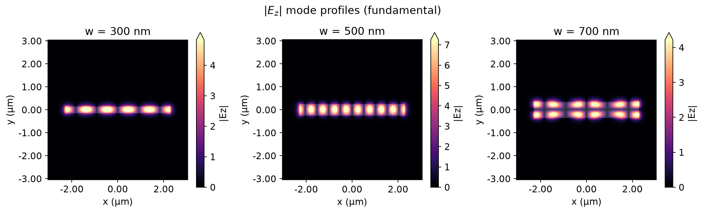

### Module 2 — Directional coupler gap sweep

Seven 3D FDTD runs sweep the coupler gap from 0.1–0.4 µm (L = 10 µm, 220 nm SOI). Smaller gap gives stronger evanescent coupling and a higher cross-port power fraction. Coupling coefficient κ(g) is extracted via η ≈ sin²(κL) with L = 16 µm effective overlap.

| Gap (µm) | 0.10 | 0.15 | 0.20 | 0.25 | 0.30 | 0.35 | 0.40 |
|----------|------|------|------|------|------|------|------|
| κ from FDTD | 0.089 | 0.056 | 0.035 | 0.025 | 0.019 | 0.015 | 0.012 |

Exponential fit to FDTD data: **κ₀ = 0.195**, **decay = 0.124 µm**. Project 1’s unfitted defaults (κ₀ = 3, decay = 0.1 µm) oscillate when plugged into sin²(κL) and do not represent the weak coupling seen here — only the **FDTD-fitted κ(g)** gives a sensible CMT overlay.

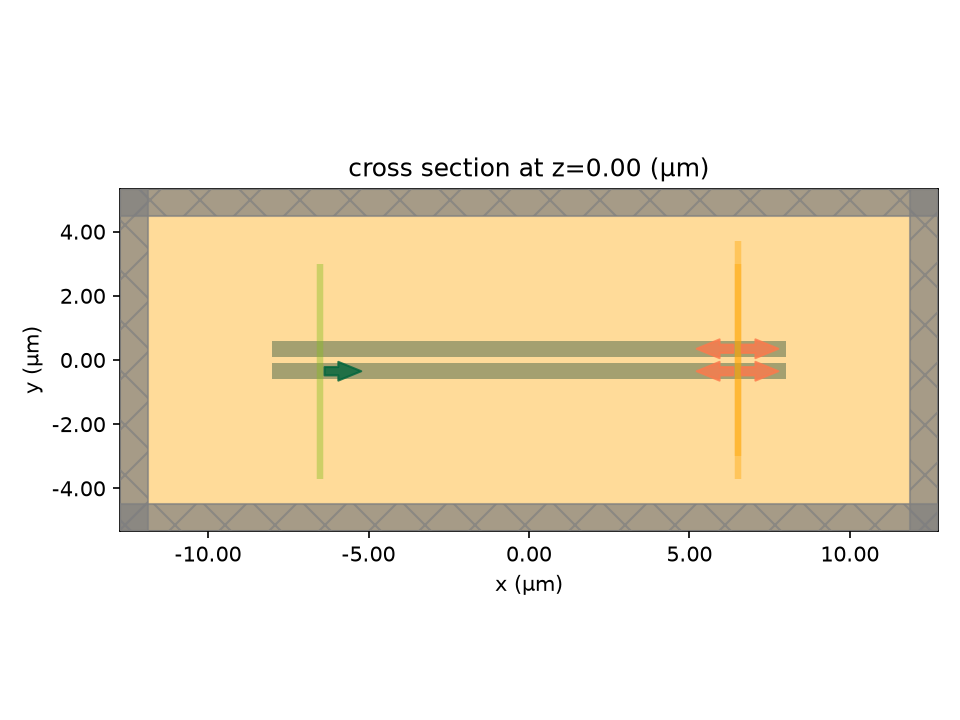

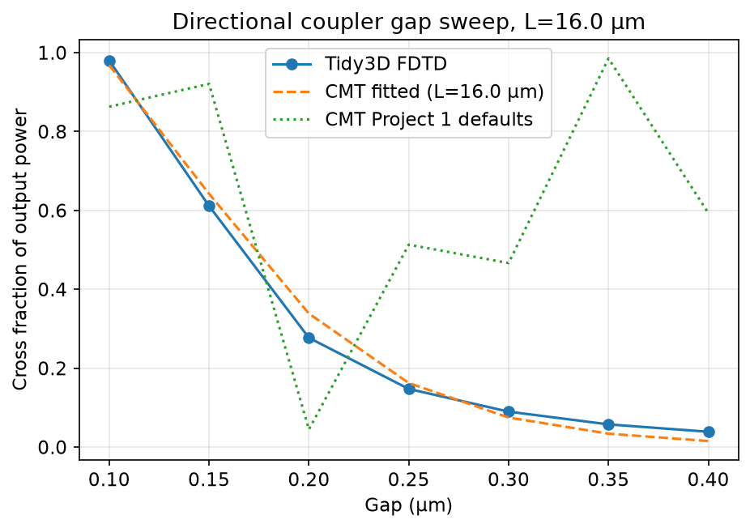

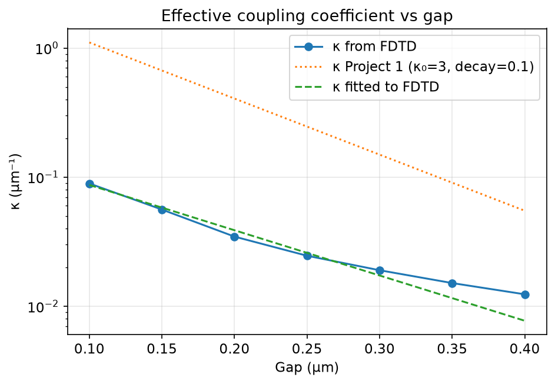

**Field animations (extreme gaps).** At 100 nm gap, power couples strongly to the cross port; at 400 nm gap, most power remains in the bar port.

| 100 nm gap | 400 nm gap |
|------------|------------|
| 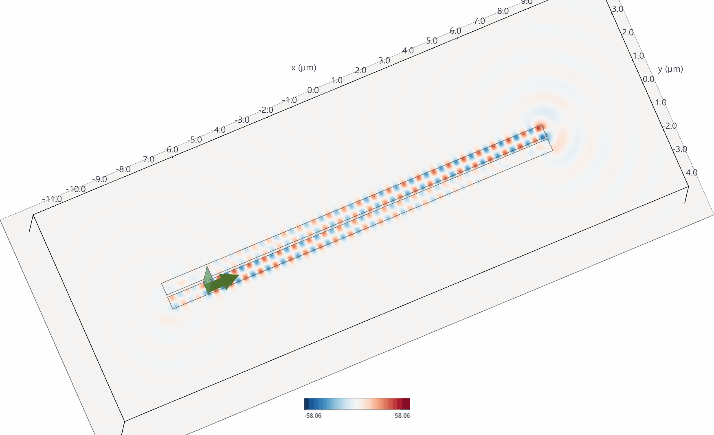 | 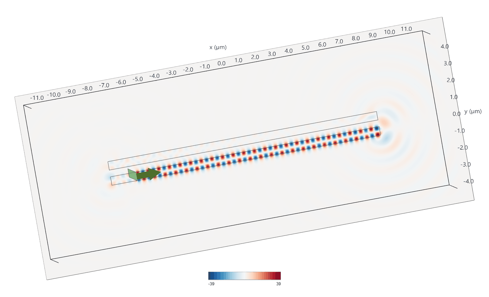 |

### Module 3 — Ring resonator Q-factor and FSR

Single-bus ring: R = 10 µm, gap = 0.2 µm, 220 nm SOI. A broadband Gaussian pulse records bus transmission vs frequency; Lorentzian fitting extracts Q and FSR.

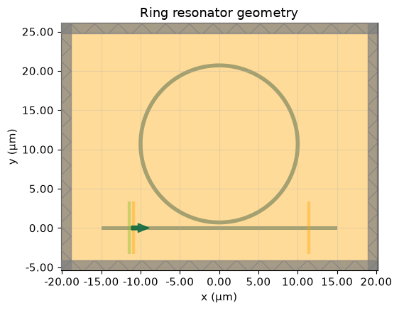

**Pass 1 — broadband scan (convergence lesson).** The wide-band run shows periodic notches with FSR ~1.16 THz, consistent with the analytical estimate ~1.14 THz (n_g ≈ 4.2). However, transmission exceeds 1 and the Lorentzian fit gives Q ≈ 9 — a sign the simulation had not fully converged (incomplete field decay for this high-Q cavity).

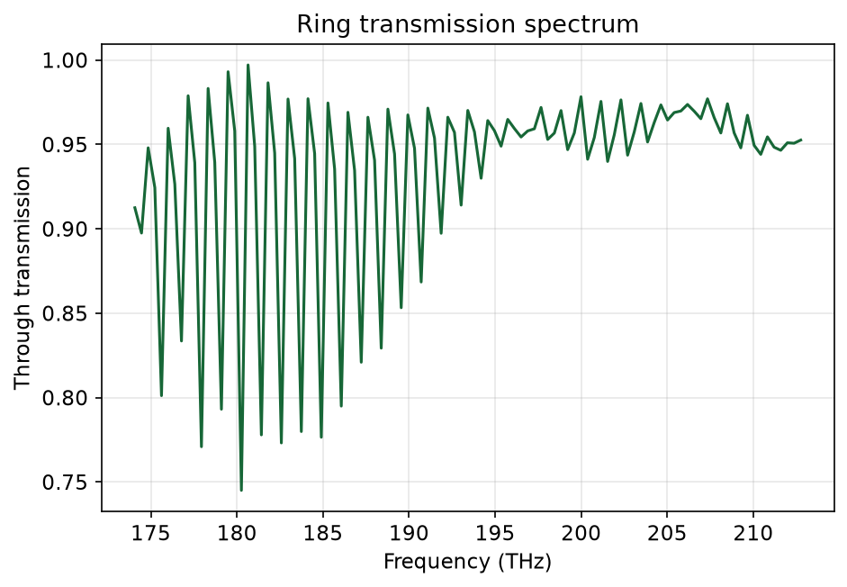

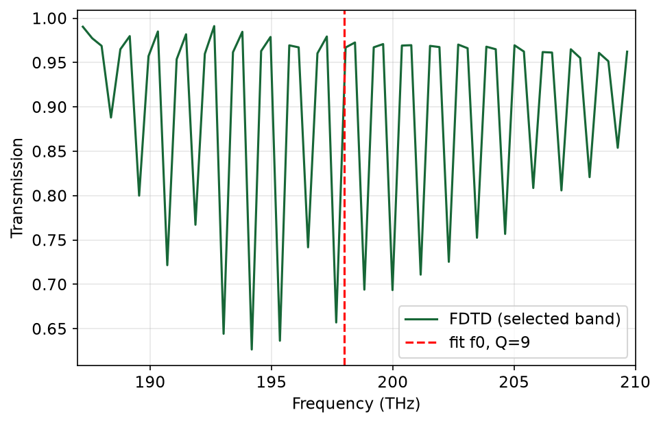

**Pass 2 — fine band (authoritative).** A narrow-band re-run (±1 THz around ~194 THz, 0.01 THz step) with a **multi-Lorentzian fit** resolves both resonances cleanly:

| Dip | Frequency | Q-factor |
|-----|-----------|----------|
| Dip 1 (deeper) | **194.87 THz** | **25,575** |
| Dip 2 | **193.75 THz** | **25,821** |

FSR from the broadband pass: ~1.16 THz sim vs ~1.14 THz analytical (n_g ≈ 4.2).

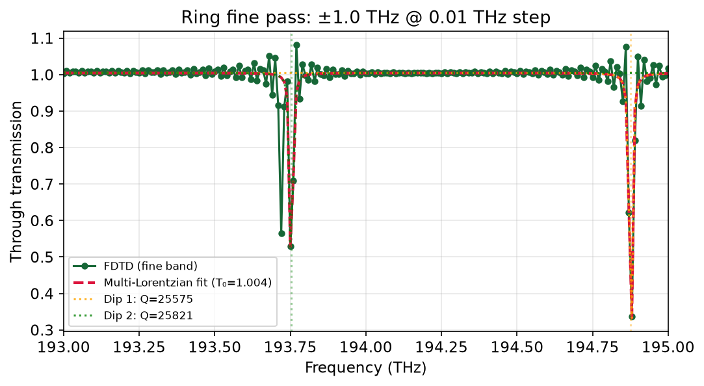

Field snapshots at both fitted resonances show stronger ring excitation at 194.88 THz (deeper transmission notch) and weaker excitation at 193.72 THz.

| 193.72 THz | 194.88 THz |
|------------|------------|
|  |  |

<details>
<summary>Ring field animations (Ex component, 193.72 and 194.88 THz)</summary>

| 193.72 THz | 194.88 THz |
|------------|------------|
|  |  |

The apparent thinning/flashing in these Ex animations is a visualization artifact (component phase and frame rate), not a physical effect — the \|E\| snapshots above show uniform ring intensity.

</details>

---

## Limitations and lessons learned

- **Broadband ring pass:** Energy had not fully decayed before the run ended, producing T > 1 and a meaningless Q ≈ 9. High-Q rings need either much longer runtime or narrow-band targeting around a single resonance.
- **Fine-band ring pass:** A single Lorentzian fit can mis-fit when multiple resonances sit in the same window — a multi-Lorentzian fit at 0.01 THz step gave Q ≈ 25,600 for both dips.
- **Coupler κ fit:** A single exponential κ(g) is qualitative — FDTD κ decays faster than the fit at small gaps and more slowly at large gaps.
- **Field animations:** Ex-component GIFs can show standing-wave-like thinning that disappears in time-averaged \|E\| plots; use magnitude snapshots for physical interpretation.
- **Geometry matters:** An early ring geometry bug (clipped/disconnected ring) was fixed in commit `105cfae` before the fine pass gave trustworthy results.

---

## Install

Requires **Python 3.11** (3.14 is not yet supported by this package pin) and a free [Tidy3D](https://tidy3d.ai) account for FDTD modules.

```bash
py -3.11 -m venv .venv
.venv\Scripts\activate          # Windows
pip install -e ".[dev]"
tidy3d configure                # API key from dashboard
python scripts/verify_auth.py
```

## Repository layout

```text
fdtd_pic/              # importable simulation logic (not in notebooks)
  config.py            # SOI stack constants (aligned with Project 1)
  materials.py         # Si / SiO2 media
  waveguide.py         # strip geometry
  modes.py             # Module 1 — ModeSolver
  coupler.py           # Module 2 — directional coupler FDTD
  ring.py              # Module 3 — ring resonator FDTD
  sweep.py             # generic cloud parameter sweeps + cache
  analytics/           # CMT overlay, Lorentzian Q fit
notebooks/             # physics narrative + orchestration only
scripts/               # verify_auth, smoke_test, generate_assets
assets/                # PNG/GIF exports for README
tests/                 # unit tests (no cloud)
```

## Quick start

```bash
python scripts/smoke_test.py              # local ModeSolver, no credits
python scripts/generate_assets.py         # regenerate Module 1 README plots
jupyter notebook notebooks/00_setup_smoke_test.ipynb
```

Modules 2–3 require a Tidy3D API key and cloud credits. Cached sweep results live in `.tidy3d_cache/` (gitignored); re-run the notebooks to regenerate or use the committed figures in `assets/`.

## Shared defaults (Project 1 alignment)

| Parameter | Value |
|-----------|-------|
| Wavelength | 1.55 µm |
| Si height | 220 nm |
| n_Si / n_SiO2 | 3.48 / 1.44 |
| Strip width | 0.5 µm |
| Coupler length | 10 µm |
| Ring radius / gap | 10 µm / 0.2 µm |

## Credit budget

| Module | Approx. cost |
|--------|----------------|
| 1 — ModeSolver width sweep | Local (free) |
| 2 — Coupler gap sweep (7 gaps) | ~7 FDTD jobs |
| 3 — Ring (broadband + fine band) | ~1–3 FDTD jobs each |

Always call `sim.plot()` before `web.run()` to catch geometry errors early.

## Tests

```bash
pytest tests/ -q
```

CI runs tests only (no Tidy3D cloud on GitHub Actions).

## Related work

- **Project 1:** [PIC-component-Library](https://github.com/Shahbaz-z/PIC-component-Library) — GDSFactory layout cells; CMT coupler curve in notebook 02 is validated here.
- **Project 3:** Polariton microcavity (TMM + MEEP) — separate repo planned.
