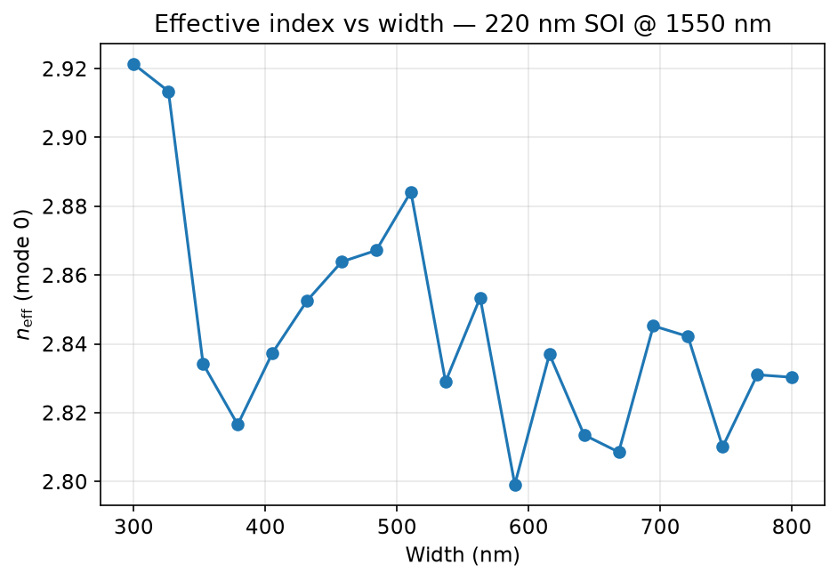
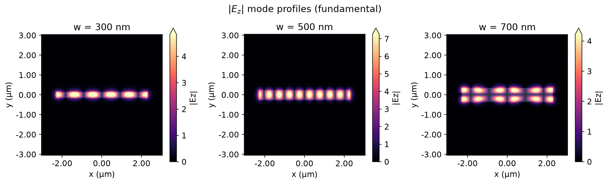

# FDTD PIC Simulations

Modular **Tidy3D** electromagnetic simulations for silicon photonics (Project 2). Companion to the layout-only [PIC-component-Library](https://github.com/Shahbaz-z/PIC-component-Library) — same SOI defaults, but here Maxwell’s equations validate the physics.

| Module | Notebook | Solver | Physics |
|--------|----------|--------|---------|
| Mode width sweep | [`notebooks/01_mode_width_sweep.ipynb`](notebooks/01_mode_width_sweep.ipynb) | ModeSolver (local) | \(n_\mathrm{eff}\) vs strip width |
| Coupler gap sweep | [`notebooks/02_coupler_gap_sweep.ipynb`](notebooks/02_coupler_gap_sweep.ipynb) | 3D FDTD (cloud) | Power splitting vs gap |
| Ring Q-factor | [`notebooks/03_ring_q_factor.ipynb`](notebooks/03_ring_q_factor.ipynb) | Broadband FDTD (cloud) | Lorentzian Q, FSR |

## Results preview (Module 1 — local ModeSolver)





Coupler and ring plots are produced after running notebooks 02–03 on the Tidy3D cloud (`assets/coupler_ratio_vs_gap.png`, `assets/ring_transmission_spectrum.png`).

## Install

Requires **Python 3.11** (3.14 is not yet supported by this package pin) and a free [Tidy3D](https://tidy3d.ai) account for FDTD modules.

```bash
cd fdtd-pic-simulations
py -3.11 -m venv .venv
.venv\Scripts\activate          # Windows
pip install -e ".[dev]"
tidy3d configure                # API key from dashboard
python scripts/verify_auth.py
```

## Repository layout

```text
fdtd_pic/              # importable simulation logic (not in notebooks)
  config.py            # SOI stack constants (aligned with Project 1)
  materials.py         # Si / SiO2 media
  waveguide.py         # strip geometry
  modes.py             # Module 1 — ModeSolver
  coupler.py           # Module 2 — directional coupler FDTD
  ring.py              # Module 3 — ring resonator FDTD
  sweep.py             # generic cloud parameter sweeps + cache
  analytics/           # CMT overlay, Lorentzian Q fit
notebooks/             # physics narrative + orchestration only
scripts/               # verify_auth, smoke_test, generate_assets
assets/                # PNG exports for README
tests/                 # unit tests (no cloud)
```

## Quick start

```bash
python scripts/smoke_test.py              # local ModeSolver, no credits
python scripts/generate_assets.py         # README plots for Module 1
jupyter notebook notebooks/00_setup_smoke_test.ipynb
```

## Shared defaults (Project 1 alignment)

| Parameter | Value |
|-----------|-------|
| Wavelength | 1.55 µm |
| Si height | 220 nm |
| n_Si / n_SiO2 | 3.48 / 1.44 |
| Strip width | 0.5 µm |
| Coupler length | 10 µm |
| Ring radius / gap | 10 µm / 0.2 µm |

## Credit budget

| Module | Approx. cost |
|--------|----------------|
| 1 — ModeSolver width sweep | Local (free) |
| 2 — Coupler gap sweep (7 gaps) | ~7 FDTD jobs |
| 3 — Ring broadband | ~1–3 FDTD jobs |

Always call `sim.plot()` before `web.run()` to catch geometry errors early.

## Tests

```bash
pytest tests/ -q
```

CI runs tests only (no Tidy3D cloud on GitHub Actions).

## Related work

- **Project 1:** [PIC-component-Library](https://github.com/Shahbaz-z/PIC-component-Library) — GDSFactory layout cells; CMT coupler curve in notebook 02 is validated here.
- **Project 3:** Polariton microcavity (TMM + MEEP) — separate repo planned.
